  
  
  
  

  

## 🛡️ Party Status

I'm an **AI Engineer Intern at Asia Energy Tech (AET)** and a **Data Science and Business Analytics** student at **KMITL**, now also studying in **Musashino University's Integrated Undergraduate–Master's Program in Data Science** in Tokyo. My work spans **Large Language Models (LLMs)**, **agentic workflows**, **knowledge graphs**, **predictive maintenance**, and **deep learning** — creating systems that automate complex tasks and transform data into actionable insights.

From **LLM fine-tuning (LoRA/QLoRA)** and **RAG architectures** to applications in **tourism, finance, healthcare, government, accessibility, education, and industrial automation** — I thrive on experimentation and turning innovative ideas into practical solutions. I also love teaching: I've been a TA for **KMITL**, the **Digital Government Development Agency (DGA)**, and **AIAT's Super AI Engineer** program.

📄 **Research:** First author of **5 accepted international conference papers** in 2026 (ITC-CSCC, IBDAP, BMEiCON, ICITEE, ICONIP), plus a second-author paper at JCSSE 2026.

**Current focus:** equipment health monitoring and LLM-powered maintenance reporting, alongside multi-agent systems that can reason, plan, and execute complex workflows autonomously.

## 🗺️ World Map

## 🎒 Inventory

## ⚔️ Side Quest

## 🏆 Achievements Unlocked

<samp>10 achievements unlocked · 3× champion · 2× 2nd runner-up · 2× 1st runner-up · Silver Medal</samp>

<table>
<tr>
<th>🏅 Achievement</th>
<th>Event</th>
<th>Innovation Highlights</th>
</tr>

<tr>
<td><strong>🥇 Winner (Royal Cup)</strong></td>
<td><strong>BDI Hackathon 2025 – Smart Tourism</strong> BDI × Chiang Mai University</td>
<td>Knowledge Graph recommendation engine mapping user preferences to Chiang Mai attractions for personalized itineraries</td>
</tr>

<tr>
<td><strong>🥇 Winner</strong></td>
<td><strong>ExxonMobil Bootcathon 2025</strong></td>
<td>Agentic workflow with n8n + Text-to-PandasQuery GenAI app for natural language data exploration</td>
</tr>

<tr>
<td><strong>🥇 Winner</strong></td>
<td><strong>Krungsri UniVerse × KMITL 2025</strong> Mule Hunt Challenge</td>
<td>Web crawling + graph visualization + LLMs to detect mule account networks and fraud patterns</td>
</tr>

<tr>
<td><strong>🥉 2nd Runner-Up</strong></td>
<td><strong>AI Thailand Hackathon 2025 (NECTEC)</strong></td>
<td>DAMZ – Zero-shot object/action detection using Thai/English natural language commands</td>
</tr>

<tr>
<td><strong>🥉 2nd Runner-Up</strong></td>
<td><strong>Huawei ICT Competition 2025</strong> Cloud Track</td>
<td>Top 3 nationally for cloud-native architectures and AI/LLM system design on Huawei Cloud</td>
</tr>

<tr>
<td><strong>🥈 Silver Medal</strong></td>
<td><strong>Super AI Engineer Season 4</strong> AIAT</td>
<td>Computer Vision & ML solutions using GBM, SVM, Transformers, and practical CV pipelines</td>
</tr>

<tr>
<td><strong>🥈 1st Runner-Up</strong></td>
<td><strong>Innovation for Crime Combating (I4C) 2023</strong></td>
<td>Deepfake video detection pipeline using CNN ensemble for DSI/NECTEC digital forensics</td>
</tr>

<tr>
<td><strong>🥈 1st Runner-Up</strong></td>
<td><strong>Krungsri UniVerse × KMITL 2024</strong></td>
<td>AI for Autism – Personalized learning content generation for children with autism</td>
</tr>

<tr>
<td><strong>🎖️ Honorable Mention</strong></td>
<td><strong>AI Thailand Hackathon 2024 (NECTEC)</strong></td>
<td>Thai CV Analyzer for resume evaluation and job matching via reusable APIs</td>
</tr>

<tr>
<td><strong>🎖️ Top 15</strong></td>
<td><strong>JUMP THAILAND 2024</strong></td>
<td>Accessibility-focused image captioning system using Transformers for visually impaired users</td>
</tr>

</table>

## 📜 Scrolls Published

<samp>6 scrolls accepted at international conferences in 2026 · 5 as first author</samp>

<table>
<tr>
<th>Venue</th>
<th>Paper</th>
<th>Role</th>
</tr>

<tr>
<td><strong>ICONIP 2026</strong></td>
<td><a href="https://github.com/E27-25/MLOps_Project">ZoonoMoE</a>: A Voice-Driven Zoonotic Disease Surveillance System via Mixture-of-Experts Routing and Domain-Partitioned Retrieval-Augmented Generation</td>
<td>First author</td>
</tr>

<tr>
<td><strong>ITC-CSCC 2026</strong></td>
<td>HIKARI: A Multi-Stage Vision-Language Prototype with RAG-in-Training for Medical Lesion Diagnosis</td>
<td>First author</td>
</tr>

<tr>
<td><strong>ICITEE 2026</strong></td>
<td>Deep-Unfolded Compressed Sensing for Energy-Efficient Wearable ECG: Diagnostic Preservation, Learned Binary Sensing, and Cross-Dataset Generalization</td>
<td>First author</td>
</tr>

<tr>
<td><strong>BMEiCON 2026</strong></td>
<td>Agents Optional, Calibration Essential: Efficient Medical Question Answering with Open Language Models</td>
<td>First author</td>
</tr>

<tr>
<td><strong>IBDAP 2026</strong></td>
<td>Yeeping-Eco: A Knowledge Graph RAG Framework with Predictive PM2.5 Routing</td>
<td>First author</td>
</tr>

<tr>
<td><strong>JCSSE 2026</strong></td>
<td>MANJU: A Multi-Agent Framework for Natural Just-in-Time Understanding in Thai</td>
<td>Second author</td>
</tr>

</table>

📌 Plus **3 conference papers under review** and **2 journal manuscripts in preparation** · 🧐 External reviewer (subreviewer) for **ICONIP 2026**

## 📋 Completed Quests

<samp>from research papers to production-ready prototypes</samp>

<table>
<tr>
<td width="50%" valign="top">

**🗺️ [RegMap AI](https://github.com/E27-25/DEMO-UN)** 
UN ESCAP RDTII · 2026 
Maps ASEAN digital-trade and data-protection laws to RDTII indicators with multilingual OCR and Llama-3.3-70B. 
`OCR` `Llama-3.3-70B` `Regulatory AI`

</td>
<td width="50%" valign="top">

**🏙️ [KhonKaen Health × City Intelligence](https://github.com/E27-25/kkc-health-city-intelligence)** 
BDI Hackathon 2026 
Unifies clinical, phenomics, and smart-city data in a knowledge graph with a cross-domain AI agent. 
`Knowledge Graph` `Qwen3-32B` `Agentic Analytics`

</td>
</tr>
<tr>
<td width="50%" valign="top">

**🏥 [Proactive Welfare Link (PWL)](https://github.com/E27-25/Demo-ICD10)** 
Hack for Right · 2026 
Automates welfare-tier assignment from ICD-10 diagnoses and Barthel ADL scores with PDPA-compliant tokenization. 
`ICD-10` `Rule Engine` `PDPA`

</td>
<td width="50%" valign="top">

**🇹🇭 Nemotron-Personas-Thailand** 
NVIDIA × CMKL · 2026 
Generated 300,000 synthetic Thai population records aligned with official statistics. 
`NVIDIA NeMo Data Designer` `Synthetic Data`

</td>
</tr>
<tr>
<td width="50%" valign="top">

**🎙️ JaiVoice** 
On-device Thai voice assistant · 2026 
Real-time, interruptible Thai voice assistant running fully on a MacBook. 
`MLX Whisper` `Qwen` `Voice-cloned TTS`

</td>
<td width="50%" valign="top">

**📡 [DiscordFlow](https://github.com/E27-25/discordflow)** 
Python library · `pip install discordflow` 
Asynchronously logs training metrics, parameters, and artifacts to Discord. 
`MLOps` `Experiment Tracking` `Python`

</td>
</tr>
<tr>
<td width="50%" valign="top">

**📄 [Agentic AI CV Generator](https://github.com/E27-25/ISD-Project)** 
Web app · 2026 
Turns text descriptions into LaTeX CVs with Qwen3-32B, a validation agent, and job matching. 
`Agents` `LaTeX` `Groq`

</td>
<td width="50%" valign="top">

**🦖 [Thai Fossil Multi-Modal Classification](https://github.com/E27-25/Data-Science-Project-DSBA-Jurassic)** 
KMITL · 2025 
Classifies fossils by scientific name and geological period from satellite imagery, Thai text, and geological data. 
`Multi-Modal DL` `Computer Vision` `NLP`

</td>
</tr>
<tr>
<td width="50%" valign="top">

**💳 [Home Credit – Credit Risk Model Stability](https://github.com/E27-25/Home-Credit---Credit-Risk-Modeling)** 
KBTG × AIAT competition 
Gradient-boosting default-risk models with Gemini-assisted analysis, focused on stability over time. 
`Gradient Boosting` `Gemini` `Credit Risk`

</td>
<td width="50%" valign="top">

**📊 [Table-Based Thai QA](https://github.com/E27-25/Table-based-ThaiQA)** 
Super AI Engineer 
Question answering over tables using retrieval-augmented generation and LLM fine-tuning. 
`RAG` `LLM Fine-Tuning` `Table QA`

</td>
</tr>
<tr>
<td width="50%" valign="top">

**🩺 [Skin Disease Image Scraper](https://github.com/E27-25/Skin-Disease-Image-Scraper)** 
Dataset tooling · 2026 
Collects up to 8,900 images across 178 skin diseases for medical image classification. 
`Web Scraping` `Medical Imaging`

</td>
<td width="50%" valign="top">

**🐾 [Thai TTS Discord Bot](https://github.com/E27-25/thai-tts-bot)** 
Discord bot 
Combines AI chat, Thai text-to-speech, and music streaming in one bot. 
`Thai TTS` `LLM Chat` `Discord`

</td>
</tr>
</table>

More: MacBook Vibration Player (Apple Silicon accelerometer) · IoT sensor REST API (Hono + PostgreSQL) · [File Organizer](https://github.com/E27-25/File-Organizer) (OCR + Naive Bayes)

## 🏰 Guild History

### ⚡ AI Engineer Intern | Asia Energy Tech (AET)
**July 2026 – Present**
- Developing **predictive maintenance models** for industrial pump sensor data, benchmarking 13 anomaly detection methods
- Built an **equipment health dashboard** integrated into the company's web platform
- Built a **multi-agent LLM maintenance-report generator** with retrieval and automated fact verification

### 🤖 AI Engineer (Part-Time) | Bot and Life
**July 2025 – February 2026**
- Designed and implemented **multi-agent pipelines** generating marketing assets from high-level prompts
- Developed advanced **prompt engineering strategies** and context design for autonomous agents
- Optimized agent workflows for consistency, reliability, and long-term task execution
- Researched and implemented novel approaches to agent coordination and communication

### 🧠 LLM & Prompt Engineer Intern | Bot and Life
**November 2024 – February 2025**
- Built **AI task management system with long-term memory** for persistent context across workflows
- Researched and implemented techniques to **reduce hallucination** in LLM applications
- Developed prompt templates and chains for complex multi-step reasoning tasks
- Experimented with various architectures for agentic behavior and tool use

### ☀️ Data Science Intern (K-LAB) | KBTG
**July 2024 – December 2024**
- Applied **PyTorch and satellite imagery analysis** to estimate rooftop solar panel potential — [solar-pv-analyzer](https://github.com/E27-25/solar-pv-analyzer)
- Created **"Condo Similarity" recommendation engine** using geospatial and property feature data — [condo-price-similarity](https://github.com/E27-25/condo-price-similarity)
- Developed data pipelines for large-scale property analysis and visualization
- Collaborated with cross-functional teams to deploy ML models in production

## 🧙 Mentor Duties

### 📘 Teaching Assistant | KMITL — Applied Machine Learning & Data Warehouse (DSBA8)
**June 2026 – September 2026**
- Built weekly labs on **scikit-learn machine learning** and **Airflow, dbt, PostgreSQL & Metabase data warehouse pipelines** — [dsba8-applied-ml](https://github.com/E27-25/dsba8-applied-ml) · [dsba8-data-warehouse](https://github.com/E27-25/dsba8-data-warehouse)
- Created a **student progress dashboard** for lab grades and a synthetic retail dataset for a CRISP-DM assignment

### 🏛️ Teaching Assistant | Digital Government Development Agency (DGA) — e-Government Executive Program
**May 2026 – August 2026 · Cohorts 1–3**
- Mentored participants in analyzing **Thai open government data** with Python, Plotly, and machine learning models
- Compiled the **[DGA Data Visualization Catalog](https://dga-data-viz-catalog.vercel.app)** of interactive dashboards produced across all three cohorts

### 🎓 Teaching Assistant | AIAT (Super AI Engineer Seasons 5 & 6)
**April 2025 – July 2025 · May 2026 – July 2026**
- Instructed on **LANTA infrastructure**, LLM inference optimization, and **LoRA/QLoRA fine-tuning**
- Facilitated paper reading sessions covering cutting-edge AI architectures and applications
- Mentored students on practical implementation of deep learning models
- Provided guidance on research methodologies and experimental design

## 🎓 Academy

**Musashino University, Tokyo, Japan** 🇯🇵  
**Integrated Undergraduate–Master's Program in Data Science**  
Faculty of International Data Science & Graduate School of Data Science  
**September 2026 – Present**

**King Mongkut's Institute of Technology Ladkrabang (KMITL)** 🇹🇭  
**B.Sc. Information Technology – Data Science and Business Analytics**  
**GPA:** 3.87  
**Expected Graduation:** 2026

**Key Areas of Study:**
- Deep Learning & Neural Networks
- Large Language Models & NLP
- Big Data Systems & Analytics
- Cloud Computing & Infrastructure
- Network Security & Cybersecurity
- Knowledge Graphs & Graph Neural Networks
- Machine Learning Operations (MLOps)

## ⏳ Play Time

  

## ✨ Current Quest

- 🔭 Building equipment health monitoring and LLM-powered maintenance reporting at **Asia Energy Tech**
- 🇯🇵 Starting the integrated undergraduate–master's program in data science at **Musashino University**
- 🧑‍🏫 Teaching Applied Machine Learning & Data Warehouse labs at **KMITL**
- 🌱 Exploring advanced RAG techniques, efficient LLM inference, and knowledge graph integration
- 📄 5 first-author papers accepted at international conferences in 2026 — more on the way
- 👯 Looking to collaborate on open-source LLM and agent projects
- 💬 Ask me about **LLMs, RAG, multi-agent systems, prompt engineering, or fine-tuning**
- ⚡ Fun fact: I've won 3 first-place hackathon awards in 2025 (and counting)!

> *"Pushing the boundaries of AI where cutting-edge research meets real-world impact"*

**Open to** 🤝 collaborations on AI/ML projects · 💡 research discussions · 🔬 experiments with LLMs and agents · 📚 mentorship 
Reach me by <a href="mailto:66070184@kmitl.ac.th">email</a> or <a href="https://www.linkedin.com/in/watin-promfiy-6b9ba221a/">LinkedIn</a>.

